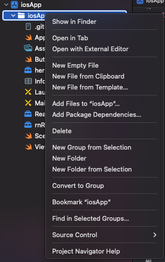
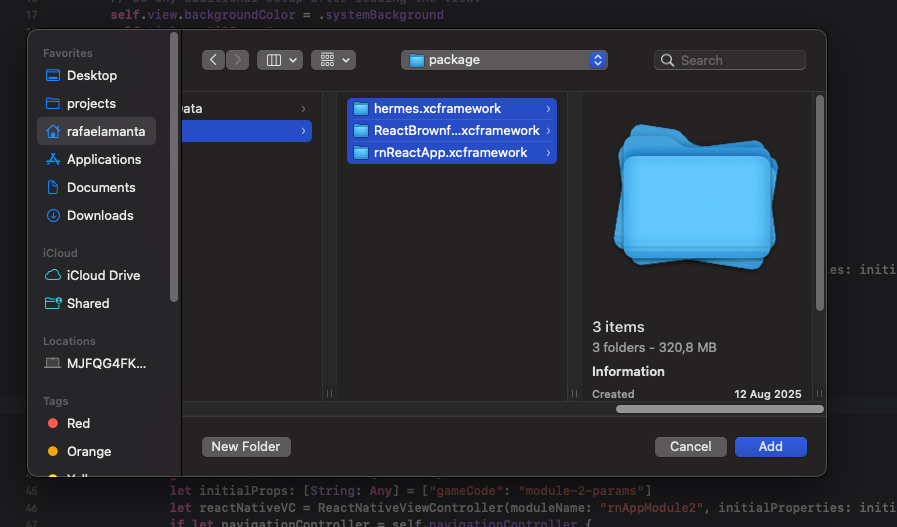
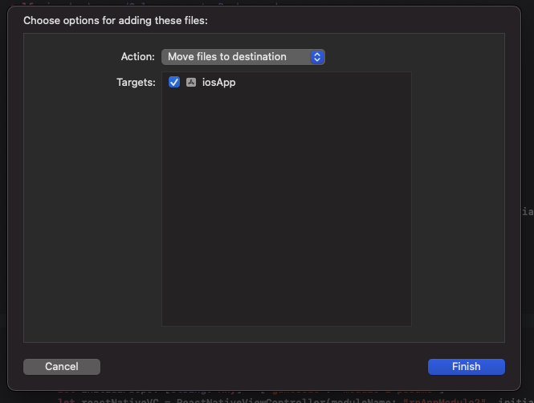

# POC Project

A proof-of-concept project demonstrating React Native brownfield integration with native iOS applications. This project showcases how to embed React Native modules within existing native iOS apps using the React Native Brownfield approach.

## 🚀 Features

### React Native Brownfield App (`rnApp`)

- **Multi-screen navigation** using React Navigation
- **Lottie animations** for enhanced UI
- **Styled components** for consistent theming
- **State management** with Jotai
- **Data fetching** with React Query

### Native iOS App (`iosApp`)

- **Native UI** built with UIKit
- **Module integration** buttons to launch React Native screens
- **Parameter passing** between native and React Native
- **Navigation integration** with React Native modules

## 🚀 Getting Started

### Prerequisites

- Node.js >= 18
- Xcode 15+ (for iOS development)
- CocoaPods
- Ruby (for iOS dependencies)

### Installation

1. **Clone the repository**

   ```bash
   git clone <repository-url>
   cd poc
   ```

2. **Install dependencies**

   ```bash
   cd rnApp
   yarn install && yarn install:ios
   ```

## 🔧 Setup & Configuration

### Create the XCFramework

```bash
yarn debug:ios
```

This command creates the necessary XCFramework that contains the React Native modules for integration with the native iOS app.

### Integration Steps

After creating the XCFramework, you need to integrate the generated files into your Xcode project:

1. **Open the Xcode project**: `iosApp/iosApp.xcodeproj` in Xcode
2. **Add files to project**: Right-click on the iosApp project and select "Add Files to iosApp"

   

3. **Locate the generated files and drag into iosApp**: The framework files are created in `.rnef/cache/ios/package`

   

4. **Add to Xcode project**

   

## 🚀 Running the Application

#### React Native Brownfield App

```bash
yarn start
```

#### Native iOS App

**Start the app**: Press the play button to start the app

### Clean cache

```bash
yarn clean
```
